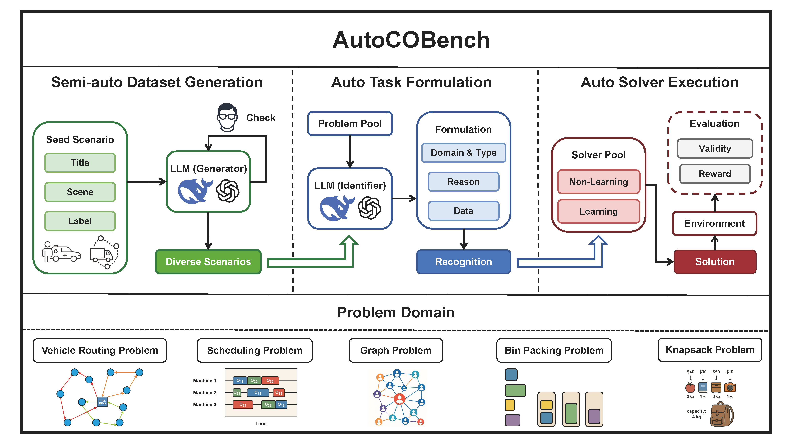

# 🚀 AutoCOBench: Automatically Formulating and Solving Combinatorial Optimization Problems

[](https://www.python.org/downloads/release/python-3100/)
[](LICENSE)

[//]: # ([![arXiv]&#40;https://img.shields.io/badge/arXiv-XXXX.XXXXX-b31b1b.svg&#41;]&#40;https://arxiv.org/abs/XXXX.XXXXX&#41;)

[//]: # ([![GitHub stars]&#40;https://img.shields.io/github/stars/your-username/LLMSolver.svg?style=social&label=Star&#41;]&#40;https://github.com/your-username/LLMSolver&#41;)

[//]: # ([![GitHub forks]&#40;https://img.shields.io/github/forks/your-username/LLMSolver.svg?style=social&label=Fork&#41;]&#40;https://github.com/your-username/LLMSolver/fork&#41;)

<div align="center">

**AutoCOBench** is a novel framework and benchmark that automates both the formulation and solution of **Combinatorial Optimization Problems (COPs)** from natural language input, balancing formulation automation with solver adaptability.



*AutoCOBench workflow: From natural language to optimized solutions*

</div>

---

## 🚀 Quick Start

### Installation

1. **Clone the repository:**
   ```bash
   git clone https://github.com/your-username/LLMSolver.git
   cd LLMSolver
   ```

2. **Install dependencies:**
   ```bash
   pip install -r requirements.txt
   ```

3. **(Optional) Install LKH for VRP solvers:**
   ```bash
   pip install lkh
   cd solver/cvrp/lkh_solver
   tar -zvxf LKH-3.0.13.tgz
   cd LKH-3.0.13
   make
   ```

### Quick Example

Here's a minimal example to run a solver on a VRP instance:

```python
from solver.solver_pool import SolverPool
from envs.mtvrp import MTVRPEnv, MTVRPGenerator
import torch

# Setup solver pool
device = torch.device("cuda" if torch.cuda.is_available() else "cpu")
solver_pool = SolverPool(
    lkh_path="path/to/LKH", 
    lkh_num_runs=30, 
    policy_dir="path/to/model_checkpoints", 
    device=device
)

# Generate and solve VRP instance
generator = MTVRPGenerator(num_loc=30, variant_preset="cvrp")
env = MTVRPEnv(generator, check_solution=False)
td_data = env.generator(1)
td_test = env.reset(td_data)

# Solve and get results
actions = solver_pool.solve(td_test.clone(), solver_name="lkh")
rewards = env.get_reward(td_test.clone().cpu(), actions.clone().cpu())
print(f"Solution: {actions}")
print(f"Reward: {rewards}")
```

See [`example/test_solver.py`](example/test_solver.py) for more detailed examples.

---

## 🎯 Supported Problems

AutoCOBench spans **43 common COP types**, each with thousands of instances annotated with natural language descriptions and structured representations.

| Domain | Problem Types | Count |
|--------|---------------|-------|
| 🚚 **VRP** | CVRP, OVRP, VRPB, VRPL, VRPTW, OVRPTW, OVRPB, OVRPL, VRPBL, VRPBTW, VRPLTW, OVRPBL, OVRPBTW, OVRPLTW, VRPBLTW, OVRPBLTW, VRPMB, OVRPMB, VRPMBL, VRPMBTW, OVRPMBL, OVRPMBTW, VRPMBLTW, OVRPMBLTW | 24 |
| ⏰ **SP** | JSSP, FJSSP, FSSP, HFSSP, OSSP, ASP | 6 |
| 📦 **BPP** | 2DOFBPP, 2DOFBPPR, 2DONBPP, 2DONBPPR, 3DOFBPP, 3DOFBPPR, 3DONBPP, 3DONBPPR | 8 |
| 🕸️ **GP** | MIS, MVC, Max Cut, Max Clique | 4 |
| 🎒 **Knapsack** | Knapsack | 1 |

---

## 🔧 Supported Solvers

### Vehicle Routing Problems (VRP)
- **LKH** - Lin-Kernighan-Helsgaun heuristic
- **PyVRP** - Python-based VRP solver
- **OR-Tools** - Google's optimization tools
- **Learning-based models** - rf-transformer, POMO, etc.

### Bin Packing Problems (BPP)
- **Genetic Algorithm** - Evolutionary approach for 2D/3D bin packing

### Knapsack Problems (KP)
- **Dynamic Programming** - Optimal solution for standard knapsack

### Graph Problems (GP)
- **Multiple approaches** - Various algorithms for MIS, MVC, Max Cut, Max Clique

---

## 🧠 LLM-based Recognition Pipeline

The `recognition/` module provides a complete pipeline:

- **🔍 Classifier:** Automatically classifies problem type from natural language description
- **✅ Checker:** Verifies and validates the classification accuracy
- **📊 Extractor:** Extracts structured problem data for solver input

---

## 📊 Benchmarks & Datasets

- **Extensive Coverage:** Datasets for VRP, BPP, KP, and more in `benchmark_hard/`
- **Ready-to-Use:** Data templates and JSON problem definitions
- **Natural Language:** Thousands of instances with human-readable descriptions
- **Structured Data:** Machine-readable problem representations

---

## 🤝 Contributing

We welcome contributions! Please feel free to:

- 🐛 **Report bugs** by opening an issue
- 💡 **Suggest features** through discussions
- 🔧 **Submit pull requests** for improvements
- 📚 **Improve documentation** and examples

---

## 📚 Citation

If you find AutoCOBench useful in your research, please cite our paper:

```bibtex
@article{autocobench2024,
  title={AutoCOBench: Automatically Formulating and Solving Combinatorial Optimization Problems},
  author={Shaofeng Zhang, Hongyuan Su, Zefang Zong, Qingwen Peng, Shengcai Liu, Shubing Liao, Ke Tang, Yong Li},
  journal={arXiv preprint},
  year={2025}
}
```

---

## 🙏 Acknowledgments

Our work builds upon the following excellent projects and research:

- **OR-Tools** - Google's optimization suite
- **PyVRP** - Python VRP solver
- **LKH** - Lin-Kernighan-Helsgaun algorithm
- **Various LLM frameworks** - For natural language processing capabilities

---

## 📄 License

This project is licensed under the Apache License 2.0 - see the [LICENSE](LICENSE) file for details.

---

<div align="center">

**Made with ❤️ by the AutoCOBench Team**

[//]: # ([![GitHub]&#40;https://img.shields.io/badge/GitHub-100000?style=for-the-badge&logo=github&logoColor=white&#41;]&#40;https://github.com/your-username/LLMSolver&#41;)

[//]: # ([![arXiv]&#40;https://img.shields.io/badge/arXiv-100000?style=for-the-badge&logo=arxiv&logoColor=white&#41;]&#40;https://arxiv.org/abs/XXXX.XXXXX&#41;)

</div>